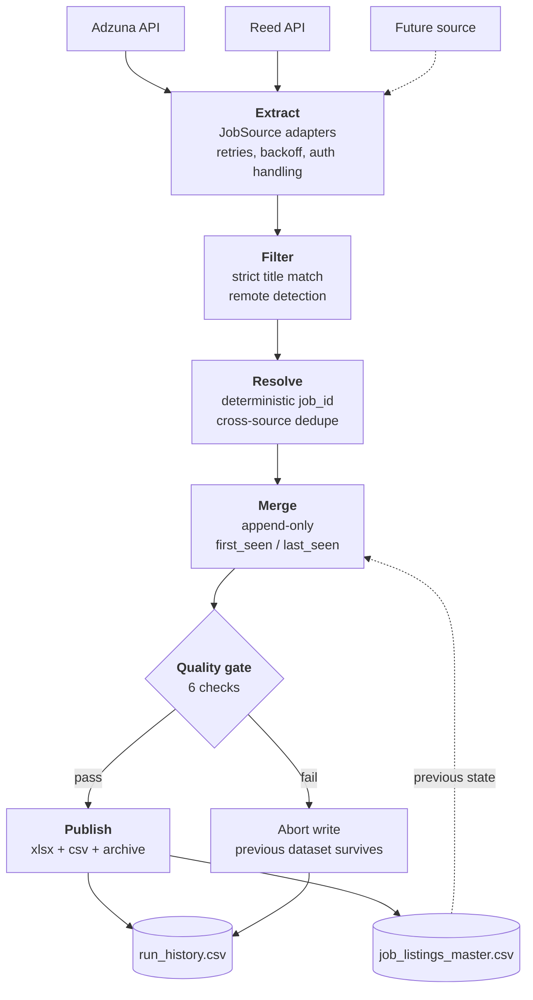

# UK Data / Analytics Engineering job pipeline

An incremental ETL pipeline that aggregates Data Engineering and Analytics
Engineering vacancies (London + remote-UK) from multiple job board APIs into a
deduplicated historical dataset, on a daily schedule, with no infrastructure to
run.

Each run extracts from every configured source, resolves the same role appearing
across sources into a single record, merges it into an append-only dataset that
tracks when each listing was first and last seen, validates the result, and
publishes Excel and CSV outputs.

| | |
|---|---|
| **Sources** | Adzuna, Reed — pluggable, see [Adding a source](#adding-a-source) |
| **Schedule** | Daily 06:00 UTC on GitHub Actions, plus a manual trigger |
| **Load pattern** | Incremental and idempotent — re-running a day is a no-op |
| **Deduplication** | Deterministic key across sources; ~50% of fetched rows collapse |
| **Quality** | Six checks gate every write; failures preserve the last good dataset |
| **Observability** | Per-run metrics appended to `data/run_history.csv` |
| **Tests** | 60, including regressions for bugs found in live data |

---

## Architecture



The dataset itself is the state store — each run reads the previous
`job_listings_master.csv` to determine what is genuinely new. That is what
makes `first_seen_date` meaningful and the run idempotent.

---

## Quick start (local)

```bash
git clone <your-repo-url>
cd job-board-aggregator

python -m venv .venv
source .venv/bin/activate        # Windows: .venv\Scripts\activate
pip install -r requirements.txt

cp .env.example .env             # then fill in your keys - see below
python main.py
```

Useful flags:

| Command | What it does |
|---|---|
| `python main.py` | Full run, writes all outputs |
| `python main.py --dry-run` | Fetches and reports, writes nothing |
| `python main.py --sources adzuna` | Only run named sources |
| `python main.py --verbose` | Debug logging, including rejected titles |
| `python -m pytest -q` | Run the test suite |

---

## API keys

Both are free and take a few minutes.

### Adzuna

1. Register at [developer.adzuna.com](https://developer.adzuna.com/).
2. Your dashboard shows an **App ID** (8 chars) and **App Key** (32 chars).
3. Put them in `.env` as `ADZUNA_APP_ID` and `ADZUNA_APP_KEY`.

Free tier is generous (hundreds of calls/day); a full run uses about 8–16.

### Reed

1. Register at [reed.co.uk/developers](https://www.reed.co.uk/developers).
2. Reed emails you an API key once your account is approved.
3. Put it in `.env` as `REED_API_KEY`.

Reed authenticates with HTTP Basic, using the key as the username and an empty
password — the adapter handles this for you.

> **Edit `.env`, never `.env.example`.** `.env` is gitignored; `.env.example` is
> committed, so a key placed there would be published to GitHub.

A missing or placeholder key means that source is skipped with a warning; the
other sources still run.

---

## GitHub Actions setup

### 1. Add your keys as secrets

In your repo: **Settings → Secrets and variables → Actions → New repository secret**.

| Secret name | Value |
|---|---|
| `ADZUNA_APP_ID` | Your Adzuna App ID |
| `ADZUNA_APP_KEY` | Your Adzuna App Key |
| `REED_API_KEY` | Your Reed API key |

Names must match exactly. Secrets are never printed in logs.

### 2. Allow the workflow to push

**Settings → Actions → General → Workflow permissions** → select
**Read and write permissions**. Without this the run succeeds but the commit
step fails with a 403.

### 3. Run it manually first

**Actions → Daily job scrape → Run workflow**. Tick **dry_run** for a no-write
test that verifies your secrets work without touching the dataset.

### The schedule and UK time

```yaml
- cron: "0 6 * * *"     # 06:00 UTC
```

GitHub cron is **always UTC**, so this fires at **07:00 BST** in summer and
**06:00 GMT** in winter. Pinning a true 07:00 year-round would need two cron
entries plus a guard step that exits outside the wanted local hour — available
on request, but rarely worth it.

Scheduled runs on GitHub are best-effort and can be delayed by several minutes
at busy times. They are also **disabled automatically after 60 days of repo
inactivity** — the daily commit normally counts as activity, so this only bites
if the workflow has been failing for a while.

### Committing results vs. artifacts

This workflow **commits outputs back to the repo**, and also uploads them as
artifacts as a backup.

Committing is the right default here because the run is *stateful*: each run
reads the previous `job_listings_master.csv` to work out what is new. Artifacts
expire (30 days here, 90 max) and are awkward to read from a later run, which
would mean every listing looked new after a gap. The commit gives you the
history for free — `git log data/` shows how the dataset grew.

The costs are a daily bot commit in your history, and a repo that grows
slowly. If you would rather keep the history clean, set
`WRITE_ARCHIVE_COPY = False` in `config.py` to stop the dated archive copies,
which are the bulk of the growth.

---

## Outputs

| File | Contents |
|---|---|
| `data/job_listings_master.csv` | The full running dataset — source of truth |
| `data/job_listings_latest.xlsx` | Two sheets: **All Jobs** and **New Today** |
| `data/job_listings_new_today.csv` | Just the listings first seen on this run |
| `data/archive/job_listings_YYYY-MM-DD.xlsx` | Dated snapshot per run |
| `data/run_history.csv` | One row per run — see [Run history](#run-history) |

The Excel file has a bold frozen header row, autofilter, sensible column
widths, thousands-separated salaries and clickable URLs. CSVs are written with
a UTF-8 BOM so Windows Excel renders `£` correctly on a double-click.

### Columns

| Column | Notes |
|---|---|
| `job_id` | Stable hash — see [Deduplication](#deduplication) |
| `first_seen_date` | Date this run first saw the listing. **Sort by this to find new roles.** |
| `last_seen_date` | Last run that still saw it — a stale date suggests the ad is gone |
| `title`, `company`, `location` | As published by the board |
| `is_remote` | Inferred from the title/location/description text |
| `salary_min`, `salary_max` | Numeric |
| `salary_currency`, `salary_period` | `annual` / `daily` / `hourly` |
| `salary_is_estimate` | **`True` means the board guessed it** — see caveats |
| `salary_raw` | Original text, where the source gave one |
| `contract_type`, `contract_time` | `permanent`/`contract`, `full_time`/`part_time` |
| `date_posted` | ISO date |
| `source` | `Adzuna` / `Reed` |
| `url` | Direct link to the posting |
| `description` | Snippet, truncated to 400 chars |

---

## Data caveats

Worth knowing before you trust a column:

- **Adzuna predicts salaries.** Roughly one listing in three carries Adzuna's
  own estimate rather than an advertised figure — including on unpaid or
  fixed-stipend roles. Filter on `salary_is_estimate = False` for advertised
  pay only. Reed publishes only advertiser figures.
- **Contract salaries are annualised day rates.** A role advertised at
  £400–450/day arrives from Adzuna as £104,000–£117,000 `annual` (their
  conversion at 260 working days). Sorting by salary therefore ranks contracts
  above permanent roles. The real rate is usually in `description`.
- **`is_remote` is a text heuristic**, matching "remote", "work from home",
  "WFH" and similar. It does not distinguish hybrid from fully remote — plenty
  of "remote" ads still want two days in the office.
- **Titles are filtered strictly.** Only titles matching Data Engineer /
  Analytics Engineer / Data Engineering / dbt variants are kept, so a relevant
  role with an unusual title is dropped. Run with `--verbose` to see what was
  rejected, and loosen `TITLE_PATTERNS` in `config.py` if it is too tight.
  Internships match too — add `r"\binternship\b"` to `TITLE_EXCLUDE_PATTERNS`
  if you do not want them.
- **Reed contract type is inferred** from the advert text, because Reed's
  search endpoint omits it and fetching it properly would cost one extra API
  call per listing. Blank means no clear signal, not "not specified".

---

## Data quality gate

Every write is gated. The checks run **after** the merge and **before** any file
is touched, so a fatal failure leaves the previous good dataset intact rather
than overwriting it with bad data — the failure mode that matters when nobody is
watching a scheduled job.

| Check | Severity | Catches |
|---|---|---|
| `no_duplicate_ids` | **fatal** | Broken dedupe double-counting rows |
| `required_fields` | **fatal** | Rows with no title, URL, id or dates |
| `row_count_stable` | **fatal** below 50% | A source returning garbage, or a truncated master file |
| `salary_ranges` | warn | Figures in the wrong period bucket (a day rate labelled annual) |
| `dates_sane` | warn | Future posting dates, `first_seen` after `last_seen` |
| `urls_usable` | warn | Malformed links in the column the whole output exists for |

Warnings are logged and the run continues. A fatal failure exits non-zero, which
turns the Actions run red. Thresholds live in `config.py`.

---

## Run history

Each run appends a row to `data/run_history.csv`, so pipeline behaviour is
visible over time rather than only in the logs of whichever run you happen to
open:

```
run_date, duration_seconds, sources_run, sources_failed, fetched_post_filter,
rejected_by_filter, new_today, total_in_dataset, quality_status,
adzuna_kept, adzuna_queries_failed, adzuna_status, reed_kept, ...
```

Useful for spotting a source silently degrading (its `*_kept` count drifting
down), runs getting slower, or the quality gate tripping repeatedly. Adding a
new source widens the file rather than breaking its schema, so old rows stay
readable.

---

## Design decisions

**Why hash the content instead of using the boards' own job IDs.**
Adzuna and Reed issue unrelated IDs for the same advert, so board IDs would put
every cross-source duplicate in the sheet twice — and Adzuna alone issues
several IDs for one syndicated advert. A hash of title + company + coarse
location collapses them. The trade-off is that an edited advert gets a new ID
and reappears as new; retitles are rarer than duplicates, so the hash wins.

**Why the dataset is the state store.**
There is no database. Each run reads the previous master CSV, merges, and writes
it back, with git providing history. At this volume (~200 rows/day) a database
would be infrastructure to maintain for no gain, and the CSV diffs readably in
a pull request.

**Why GitHub Actions rather than an orchestrator.**
Cron on Actions is the right size for one daily task with no inter-task
dependencies. Airflow or Dagster would earn their place once there were
backfills to run, dependencies between assets, or per-task retries — none of
which exist here.

**Why the quality gate blocks the write rather than warning.**
A scheduled pipeline nobody watches fails silently by default. Refusing to write
means the worst case is a stale dataset and a red build, instead of a
successfully-overwritten broken one.

**Why one source failing never fails the run.**
Sources are independent, so a Reed outage should not cost you Adzuna's listings.
The run only exits non-zero when *every* source fails — a distinction that
matters, because "found nothing" and "everything errored" otherwise look
identical in the output.

---

## Configuration

Everything tunable lives in `config.py`:

| Setting | Purpose |
|---|---|
| `KEYWORDS` | Search terms, one query per keyword per pass |
| `SEARCH_PASSES` | The London (40km radius) and remote-UK sweeps |
| `RESULTS_PER_QUERY` | Results per individual query (default 50) |
| `MAX_RESULTS_PER_SOURCE` | Per-run ceiling per source, guards your API quota |
| `MAX_DAYS_OLD` | Ignore anything older (default 30 days) |
| `TITLE_PATTERNS` / `TITLE_EXCLUDE_PATTERNS` | The strict title filter |
| `REMOTE_PATTERNS` | Remote detection |
| `WRITE_ARCHIVE_COPY` | Dated snapshot per run |

---

## Deduplication

`job_id` is a hash of **title + company + coarse location**, so the same role
found by several keyword searches — or by both Adzuna and Reed — collapses into
one row.

Two wrinkles the naive version got wrong:

- **Locations are coarsened first.** Boards syndicate one advert at different
  granularities, so the same job appears as `South East London, London` and
  `London, UK`. Both reduce to `london`. Different cities stay distinct.
- **Anonymous employers fall back to the URL.** Agencies post as
  `Confidential`, and a title+company hash would wrongly merge unrelated roles.

A listing already in the dataset keeps its original `first_seen_date` and has
`last_seen_date` bumped. An advertised salary will overwrite a stored estimate,
but never the other way round.

---

## Adding a source

1. Create `sources/yourboard.py` with a class implementing `JobSource`:

   ```python
   class YourBoardSource(JobSource):
       name = "YourBoard"

       def is_configured(self) -> bool: ...
       def fetch(self, query: SearchQuery) -> list[JobListing]: ...
   ```

2. Register it in `sources/__init__.py` under `ALL_SOURCES`.

That is all — `main.py` picks it up, and filtering, dedupe, merging and output
happen automatically. Use `self._get_json(url, params, auth=...)` for the
shared retry/backoff behaviour, and raise `SourceError` on failure.

`sources/adzuna.py` (API key in query params) and `sources/reed.py` (HTTP Basic)
are the two worked examples.

**Indeed and LinkedIn are not viable.** Indeed's Publisher API was deprecated
in 2024 and its program has been closed to new signups since 2022; the
remaining APIs are employer-side only. LinkedIn has no public jobs-search API
at all, and scraping it breaches their User Agreement. Better additions are
Careerjet or Jooble (both free keys), or the public Greenhouse/Lever/Ashby
board endpoints, which return employer-direct listings with no key at all.

---

## Error handling and logging

- A source with missing credentials is skipped with a warning.
- A source that fails entirely is logged; other sources still run and the
  dataset is still written.
- A rejected API key raises immediately rather than retrying every query.
- Transient errors (429, 5xx, timeouts) retry three times with backoff.
- The run exits non-zero only if **every** source fails — which is what makes a
  failing CI run visible instead of silently green with an empty dataset.

Each run logs listings fetched, kept, rejected and newly added. Logs go to the
console and to `logs/run.log` (gitignored, rotated at 1 MB, uploaded as a
workflow artifact).

---

## Project structure

```
config.py                 Search terms, filters, paths, limits
main.py                   Orchestrator: fetch -> filter -> dedupe -> merge -> write
sources/
  base.py                 JobSource ABC, SearchQuery, shared HTTP with retries
  adzuna.py               Adzuna adapter
  reed.py                 Reed adapter
core/
  models.py               JobListing dataclass, canonical column order
  salary.py               Salary parsing and normalisation
  filters.py              Strict title matching, remote detection
  dedupe.py               job_id hashing, merge into the running dataset
  quality.py              Pre-write data quality gate
  metrics.py              Per-run metrics -> run_history.csv
  storage.py              CSV/Excel reading and writing, Excel formatting
  logging_setup.py        Console + rotating file logging
tests/                    Unit tests for parsing, filtering, dedupe, failure modes
.github/workflows/        Daily scheduled run
data/                     Outputs (committed)
```

---

## Troubleshooting

| Symptom | Cause |
|---|---|
| `credentials not set` | Key missing or still a `your_...` placeholder in `.env` |
| `authentication failed (HTTP 401)` | Key wrong, or Reed account not yet approved |
| Workflow commit fails with 403 | Workflow permissions not set to read/write |
| Everything looks new after a gap | `job_listings_master.csv` missing or not committed |
| `£` shows as `£` in Excel | Opening an older CSV written before the BOM fix — rerun |
| No listings at all | Title filter too strict; check `--verbose` output |
| Run exits 1, `quality_status=failed` | A fatal check tripped — the log names it; the dataset was left untouched |
